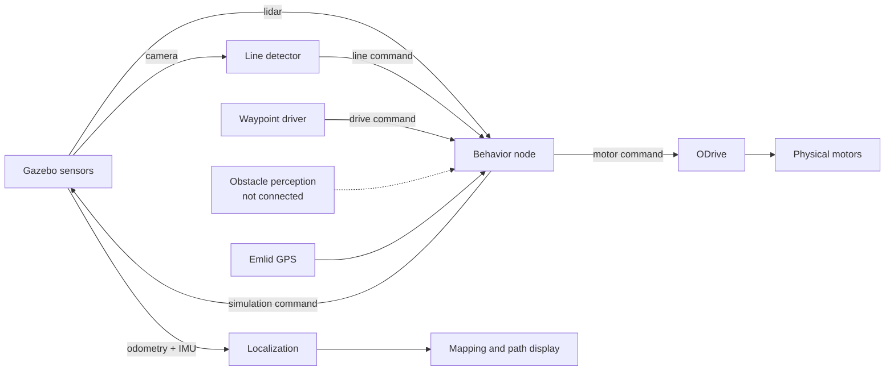

# Architecture

The main ROS 2 package combines simulation, navigation experiments, and some physical-hardware code. It is a useful base, but the simulation and robot paths still need to be separated.

## Current flow

The dotted connection is the clearest missing perception piece. The motor path is real code and is currently mixed into the simulation launch, so do not run it on connected hardware.

## Main pieces

| Part | Job | Current state |
|---|---|---|
| Line detector | Finds the white course line from RGB images | Connected in simulation |
| Behavior node | Chooses between lidar, obstacle, waypoint, map, and line commands | Connected, but commands can go stale |
| Waypoint driver | Turns odometry and waypoints into drive commands | Connected to simulated odometry |
| ODrive node | Converts drive commands into wheel commands | Connected even during simulation |
| GPS, EKF, and mapping | Estimate position and build a map | Configured, but not proven on the robot |
| Physical sensors | Camera, lidar, IMU, and wheel odometry | No complete launch path found |
| Depth prototypes | OAK-D white-point filtering and a depth occupancy grid | Preserved under `prototypes/`, not connected |

## What the behavior node does

The behavior node gives priority to close lidar obstacles, then obstacle perception, waypoints, map avoidance, and finally line following. The main concern is that it can keep using an old command after an input stops updating.

## Future improvements

Right now, the active system mainly follows an RGB line. The older ROS 1 code includes RealSense and depth work, and the ROS 2 prototypes include OAK-D point filtering and a depth grid.

The next step is to connect RGB and depth, turn the obstacle input into a working part of the stack, and evaluate a lightweight segmentation or obstacle model on the RTX 3060. The existing prototypes give the team a head start on that work.

For the folder layout, see [`PROJECT_MAP.md`](PROJECT_MAP.md). For the immediate blockers, see [`KNOWN_ISSUES.md`](KNOWN_ISSUES.md).
